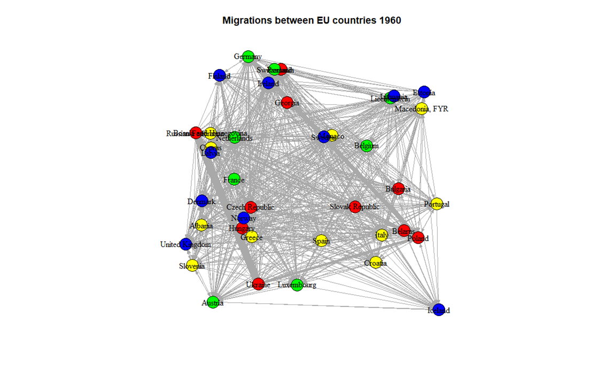

```{r setup, include = FALSE}
library("papaja")
r_refs("r-references.bib")
```

```{r analysis-preferences, include = FALSE}
# Seed for random number generation
set.seed(42)
knitr::opts_chunk$set(cache.extra = knitr::rand_seed)
```

# Citations in papaja, detele appropriately later

Add the bibtex entry in the .bib file. You can find the entries in Google scholar, but double check since it is not always correct.

Call the citations in the text:

Citation within parentheses [@R-papaja]

Multiple citations [@R-papaja; @R-base]

In-text citations @R-papaja

Year only [-@R-base]

Only if your citation appears in the text it will also show up in the Reference list. Don't manually modify the Reference list.

## Executive Summary

(150 words) -- 0.3 POINTS Summarize the report. Write this as the very last thing.

What is the main topic you are addressing?

what are your research questions and hypotheses?

what are your results and the main conclusion?

## Introduction

(about 1000 words) -- 0.5 POINTS Place your topic of choice within the existing literature and explain what you are going to address in this report and why. - What is the main topic that is going to be studied in this paper? - Why is it important?

::: {style="text-align: justify"}
Humanity has always moved a lot, for many different reasons, such as work or study opportunities, for safety of to join family. Because there are so many factors that play a role in migration, a lot of research has already been performed on this topic. However, at the same time, there are still a lot of thing unknown, which is why this paper will elaborate further on the topic of migration. In this paper, the focus will be specifically on migration within Europe with the use of social network analysis.
:::

### Importance

::: {style="text-align: justify"}
As mentioned, humanity has always moved a lot, however the amount of migration has increased with time. In 2020, it was estimated that 281 million people live in a country that is not their country of birth [@united2019world]. This is over three times the estimated number in 1970. With this increase in migration, come a lot of other changes, since migration has different effects on a country. For example, research has shown that skilled migrants have a positive effect on innovation [@fassio2019skilled]. Besides that there are effects on the economy, since migration "boosts the working-age population" and "contributes to technological progress" [@oecd2014is].

Since it migration has many different effects, it is important to know why people move. This way, it can be determined which countries will be more affected by migration and the effects of it can be anticipated. In line with this reasoning, Dustmann and Frattini [-@dustmann2011immigration] found differences in the rate of European born immigrants between different European nations. An example they give is Ireland, where 70% of the immigrants are from Europe, compared to UK where only 21% are from Europe.
:::

### Current research

::: {style="text-align: justify"}
Some researchers have already looked at the reasons why people migrate to other countries. The European Parliament has determined three push and pull factors for leaving a country, namely the social-political factors, demographic and economic factors and environmental factors [@europe2020exloring].

Socio-political factors can be described as persecution, politics  [@lam2002interaction] or culture [@kontuly1995culture]. Davenport et al. [-@davenport2003sometimes] indeed find that threats to personal integrity are the most important reason why people migrate. Demographic and economic factors are labor standards, unemployment [@davanzo1978does] and the country's overall economic health [@czaika2015migration]. Finally environmental factors can be fleeing of natural disasters [@drabo2015natural; @berlemann2017climate] and possibly in the future climate change. Finally an important factor to keep in mind is technology, and technological development. Because of technological progress, jobs are created as well as destructed [@mortensen1998technological]. According to Hillmann et al. [-@hillmann2022technological] this loss of jobs in certain segments of the labor market can cause people to move elsewhere. Moreover, when the country of origin lacks technological progress, outmigration is more attractive.
:::

### Hypothesis

::: {style="text-align: justify"}
To be able to answer the question of why people migrate, two different questions need to be answered. First, it needs to be determined through which people migrate and whether this changes over time. With this information, possible travel paths can be determined, which can in turn help in explaining why and how people migrate. Research has determined that "physical distance and border effects are significant predictors of migration flows among OECD countries" [@tranos2015international]. Here physical distance refers to how close countries are to each other. When looking at Europe, this would mean that most migrants would travel to our via the middle point of Europe, which is Belarus or Lithuania. Based on boarder effect, Austria would be an interesting node for centrality, since it shares borders with eight different countries. Another interesting approach is looking at the migration routes and flows in Europe, such as the Western African Route, Western Mediterranean Route, Central Mediterranean Route, Western Balkan Route, Eastern Mediterranean Route, Eastern Borders Route and the The Channel Route [@westernroute]. Based on these migration routes, it appears that Austria plays an important role for migration within Europe [@guggenheim2019what; @ambrosini2016europe]. Based on this information the following hypothesis can be formulated:

- Hypothesis 1: Austria has a high centrality in the social network of Europe's migration

Besides looking at the network itself, it is important to also take into account endogenous and exogenous variables. As mentioned before, many different factors have been found that impact migration. In this research all of these factors will be considered, and since technical development is becoming more and more important, we hypothesize that:

- Hypothesis 2: The technical development of a country will have a more positive effect on the level of migration to that country with time
:::

### Methods

::: {style="text-align: justify"}
As mentioned before, this study make use of social network analysis, so a network has been created for different countries in Europe. In the network, each country is a different node and each edge is a stream of migration. These edges are also weighted, where the weights represent the amount of people migrating from one country to another. 

- First method: Centrality/CUG 
- Second method: GERGM

**Still need to explain why we use these methods right?**
:::

### Contributions
::: {style="text-align: justify"}
So far, the approach used in this research has not been used. By combining network analysis with many different variables, the impact of the variables can be compared and a most important factor can be determined. As mentioned in the introduction, the results from this research can help countries understand how many migrants are coming to this country, and possibly also why they are coming. With this information, appropriate accommodations can be made for them and the impact of having these migrants can be determined.

-   **What does the rest of the report look like? In one short paragraph, list the topics of the following sections.**
:::

## Methodology

### Dataset

(about 500 words) 1 POINT (+ BONUS) \* Which data set are you going to use? Three options:

o Use readily/easily available data (0 bonus points)

o Combine two or more existing datasets (max 0.5 bonus points)

o Scrape or collect your own data (max. 1 bonus point)

-   Clearly explain where the data is coming from:

o Who collected the data?

o What is the source?

o When was the data produced?

o How was the data collected?

-   Provide descriptive measures of your data (tables, plots, etc.)

-   Why is this data useful to study your topic and answer your research questions?

-   What is the potential bias in the data? How does this affect your results?

::: {style="text-align: justify"}
The data used for the research project consists out of several publicly accessible datasets retrieved from the World Bank [@world_bank_data]. These datasets are:

- Global Bilateral Migration: Global matrices of bilateral migrant stocks spanning the period 1960-2000, disaggregated by gender and based primarily on the foreign-born concept. Gathered through various censuses. Last updated on 06-28-2011.

- World Development Indicators: World development indicators, compiled from officially recognized international sources spanning the period 1960-2000. Last updated on 09-16-2022.
:::

```{r, column_names, warning = FALSE, echo = FALSE, message = FALSE}
library('readxl')

my_data <- read_excel('../attributes_data.xlsx')

names <- colnames(my_data)
numbers <- c(1:length(names))
tab <- data.frame(numbers, names)
tab <- setNames(tab, c('Column Number', 'Column Name'))

knitr::kable(tab)
```

::: {style="text-align: justify"}
To answer the research question data regarding migration patterns between European nations are necessary. Additional information which might possibly influence said migration is also required. The combined dataset contains information about multiple nations including all European nations. As seen in table various characteristics of the European nations throughout the decades in the late 20^th^ century are also available. This provides the opportunity to analyse the effect of changes within the European nations over the years on migration.

```{r, exploration_plots_prep, echo = FALSE, warning = FALSE, message = FALSE}
library("writexl")
library("dplyr")
library("ggplot2")

# Migration data
migration_data <- read_excel('../migration_data.xlsx')

# Rename additional attributes
drop <- c("Time Code", "Country Code")
info_data = my_data[,!(names(my_data) %in% drop)]
info_data <- setNames(info_data, c("Year", "Country", "Airtransport", "Energy", "Cereal", "Electricpower", "Employers", "Telephonesubscriptions", "GDP", "Internet", "Lifeexpectancy", "Techexports", "Techmanufacturing", "Mobilesubscriptions", "Mortalityfemale", "Mortalitymale", "Drinkingwater", "Journalarticles", "Internetservers", "Survival65female", "Survival65male", "Technicians"))

# Filters for plots
netherlands <- info_data %>% filter(Country == 'Netherlands')
poland <- info_data %>% filter(Country == 'Poland')
ireland <- info_data %>% filter(Country == 'Ireland')
```

```{r, exploration_plot_one, echo = FALSE, warning = FALSE, message = FALSE, out.width= '100%', fig.cap = 'GDP growth in the Netherlands'}
plot(netherlands$Year, netherlands$GDP, type='l', main='GDP Growth for the Netherlands', xlab='Year', ylab='Growth in percentage')
```

```{r, exploration_plot_two, echo = FALSE, warning = FALSE, message = FALSE, out.width= '100%', fig.cap = 'Telephone subscriptions in Poland'}
plot(poland$Year, poland$Telephonesubscriptions, type='l', main='Fixed telephone subscriptions in Poland', xlab='Year', ylab='Amount of fixed telephone subscriptions')
```

```{r, exploration_plot_three, echo = FALSE, warning = FALSE, message = FALSE, out.width= '100%', fig.cap = 'Mortality rate of males in Ireland'}
plot(ireland$Year, ireland$Mortalitymale, type='l', main='Male mortality rate in Ireland', xlab='Year', ylab='Mortality rate, adult, male (per 1,000 male adults)')
```

The oldest data points stem from 1960, from 1960 onwards European nations have seen quite a number of changes. Some nations within the dataset did not exist in their current condition across all of the years existent in the dataset, Germany for example only exists as Germany whereas for most of the time period represented in the dataset Germany was actually two countries (West Germany and East Germany). This could mean that for some nations the data itself is not completely accurate as the numbers existent in the dataset are a sum of the numbers for both nations. This might skew the data and results.


:::

### Data analysis (Research Rationale)

(about 500 words) -- 1 POINTS \* Why are these two methods suitable for your data?

-   Why are these two methods suitable for your research questions?

-   Are there other methods to address these questions? If yes, why are the methods you chose better for this case?

::: {style="text-align: justify"}
For determining the most central country in Europe regarding migrant streams, the stress centrality measure was used. This method determines the number of shortest paths through a node -- excluding the paths to and from that node -- for every node in the network. With that, the country with the highest stress centrality can be considered as a 'bridge' for migrant streams within Europe. This country will be the most central player in migrant streams in Europe. This method fits the dataset because it considers incoming as well as outgoing edges. So, the migrant streams pass through a country. The stress centrality measure was used to determine the most central country per decade.

One could also choose to use the eccentricity measure to determine the centrality of a country. The eccentricity measure determines the maximum number of steps needed to reach anyone else for every node. Therefore, the country with the minimum eccentricity would be the most central country. However, this method does not fit to the purpose of this research. This method will only consider outgoing edges from a specific country, whereas this research also wants to account for incoming edges because of migrant streams. Next to eccentricity, there are many other methods. For instance, betweenness centralization, closeness centralization or eigenvector centralization. However, these methods either result in a graph level score or do not fit the problem at hand.
:::

## Results

(about 2000 words)

### Model 1

(about 1000 words) -- 2.5 POINTS

-   Present your results appropriately (plots, tables...) and discuss your findings in plain English

-   Discuss the meaning of your findings in relation to your hypothesis. (half of the points evaluated in this other part)

```{r echo = FALSE, results = 'asis'}
# table example
cn <- c("age", "gender", "eyes_col")
one <- c(7, "M", "BLUE")
two <- c(8, "F", "BROWN")
three <- c(8, "M", "GREEN")
four <- c(7, "F", "PINK")

tab <- rbind(cn, one, two, three, four)
rownames(tab) <- NULL
knitr::kable(tab)
```

### ERGM

(about 1000) -- 2.5 POINTS

-   Present your results appropriately (plots, tables...) and discuss your findings in plain English

-   Discuss the meaning of your findings in relation to your hypothesis. (half of the points evaluated in this other part)

Option 1:

```{r model 1, echo = FALSE}
# model results display example
ctl <- c(4.17,5.58,5.18,6.11,4.50,4.61,5.17,4.53,5.33,5.14)
trt <- c(4.81,4.17,4.41,3.59,5.87,3.83,6.03,4.89,4.32,4.69)
group <- gl(2, 10, 20, labels = c("Ctl","Trt"))
weight <- c(ctl, trt)
lm.D9 <- lm(weight ~ group)
lm.D90 <- lm(weight ~ group - 1)

# install.packages("texreg")

knitr::kable(texreg::matrixreg(lm.D9))


```

Option 2

```{r model 2, echo = FALSE, results = 'asis'}
# model results display example
ctl <- c(4.17,5.58,5.18,6.11,4.50,4.61,5.17,4.53,5.33,5.14)
trt <- c(4.81,4.17,4.41,3.59,5.87,3.83,6.03,4.89,4.32,4.69)
group <- gl(2, 10, 20, labels = c("Ctl","Trt"))
weight <- c(ctl, trt)
lm.D9 <- lm(weight ~ group)
lm.D90 <- lm(weight ~ group - 1)

# install.packages("texreg")

knitr::kable(texreg::matrixreg(list(lm.D9, lm.D90)))


```

Option 3

```{r model 3, echo = FALSE}
# model results display example
ctl <- c(4.17,5.58,5.18,6.11,4.50,4.61,5.17,4.53,5.33,5.14)
trt <- c(4.81,4.17,4.41,3.59,5.87,3.83,6.03,4.89,4.32,4.69)
group <- gl(2, 10, 20, labels = c("Ctl","Trt"))
weight <- c(ctl, trt)
lm.D9 <- lm(weight ~ group)
lm.D90 <- lm(weight ~ group - 1)

# install.packages("texreg")


texreg::plotreg(lm.D9)


```

Option 4

```{r model 4, echo = FALSE}
# model results display example
ctl <- c(4.17,5.58,5.18,6.11,4.50,4.61,5.17,4.53,5.33,5.14)
trt <- c(4.81,4.17,4.41,3.59,5.87,3.83,6.03,4.89,4.32,4.69)
group <- gl(2, 10, 20, labels = c("Ctl","Trt"))
weight <- c(ctl, trt)
lm.D9 <- lm(weight ~ group)
lm.D90 <- lm(weight ~ group - 1)

# install.packages("texreg")

texreg::plotreg(list(lm.D9, lm.D90))

```

## Conclusion

(about 350 words) -- 0.7 POINTS What were your topic and research questions again? (1 sentence)

What did you learn from the two analysis you run? \*\*\* most important point to address 0.5 POINTS here

Who benefits from your findings?

What does remain an open problem?

Can you give suggestions for future work in this area?

\newpage

# References

```{=tex}
\begingroup
\setlength{\parindent}{-0.5in}
\setlength{\leftskip}{0.5in}
```
::: {#refs custom-style="Bibliography"}
:::

```{=tex}
\endgroup
```
